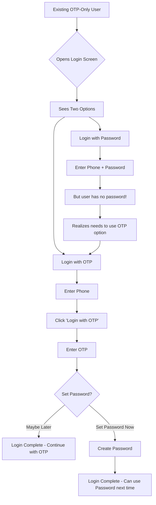

# Backward Compatibility Fix for Existing OTP-Only Users

## Issue Identified

After implementing the hybrid authentication system, existing users who previously logged in with OTP only were unable to login because:

1. The login screen required BOTH phone number AND password
2. Existing users don't have a password set yet
3. There was no visible way to login with OTP for these users

## Solution Implemented

Added a **"Login with OTP"** button on the login screen that allows existing OTP-only users to continue using their familiar login method.

---

## Changes Made

### File: `app/auth/login.tsx`

**Added**: "Login with OTP" button alongside "Forgot Password?" link

```tsx
// New button that sends OTP and navigates to OTP verification
<TouchableOpacity
  style={styles.otpLoginButton}
  onPress={async () => {
    if (phone.length !== 10) {
      Alert.alert('Invalid Phone', 'Please enter a valid 10-digit mobile number');
      return;
    }
    const result = await authService.sendOTP(phone, 'login');
    if (result.success) {
      router.push({ pathname: '/auth/otp' as any, params: { phone, mode: 'login' } });
    } else {
      Alert.alert('Error', result.error || 'Failed to send OTP');
    }
  }}
>
  <Text style={styles.otpLoginText}>Login with OTP</Text>
</TouchableOpacity>
```

---

## How It Works Now

### For Existing OTP-Only Users:

1. User opens app and goes to Login screen
2. User enters their 10-digit phone number
3. **User clicks "Login with OTP"** (new button)
4. OTP is sent to their phone
5. User enters OTP
6. User sees optional prompt: "Set up a password for better security"
   - Option 1: "Set Password Now" → Creates password and can use it next time
   - Option 2: "Maybe Later" → Logs in and can continue using OTP
7. User is logged in successfully

### For New Users (or users with password):

1. User opens app and goes to Login screen
2. User enters phone number AND password
3. User clicks "Login"
4. User is logged in successfully

---

## Updated Login Screen UI

```
┌─────────────────────────────────────┐
│         Welcome back!                │
│    Login to continue shopping        │
│                                      │
│  Mobile Number                       │
│  ┌───────────────────────────────┐  │
│  │ +91 [__________]              │  │
│  └───────────────────────────────┘  │
│                                      │
│  Password                            │
│  ┌───────────────────────────────┐  │
│  │ [__________]            👁     │  │
│  └───────────────────────────────┘  │
│                                      │
│  ┌───────────────────────────────┐  │
│  │         Login                  │  │
│  └───────────────────────────────┘  │
│                                      │
│  Forgot Password?   Login with OTP  │  ← NEW!
│                                      │
│  Don't have an account? Sign Up     │
└─────────────────────────────────────┘
```

---

## Testing the Fix

### Test Case: Existing OTP-Only User Login

1. **Setup**: Use a phone number that exists in database but has `password_hash = NULL`

2. **Steps**:
   - Open login screen
   - Enter the phone number
   - Click "Login with OTP" (don't enter password)
   - Enter the OTP received
   - Choose "Maybe Later" when prompted to set password

3. **Expected Result**:
   - ✅ User is logged in successfully
   - ✅ User can access the app normally
   - ✅ No errors or blockers

### Test Case: Existing User Decides to Set Password

1. **Steps**:
   - Follow above steps until OTP verification
   - Choose "Set Password Now"
   - Create and confirm new password
   - Logout
   - Login with phone + password (no OTP needed)

2. **Expected Result**:
   - ✅ Password is saved
   - ✅ User can now login with password
   - ✅ Next login doesn't require OTP

---

## User Communication

### For Support Team:

**If existing user says "I can't login anymore":**

**Response**: 
"We've added password login for better security, but you can still use OTP login! Here's how:

1. On the login screen, enter your phone number
2. Click the 'Login with OTP' button (below the password field)
3. Enter the OTP sent to your phone
4. You'll be logged in as usual

Optional: You can set up a password for quicker logins in the future."

### In-App Notification (Optional):

Consider showing a one-time banner to existing users:
```
"New Feature! You can now login with a password for faster access. 
Click here to set up your password, or continue using OTP login."
```

---

## Migration Path for Existing Users



---

## Summary of Fix

✅ **Problem Solved**: Existing OTP-only users can now login without any blockers

✅ **User Experience**: Clear "Login with OTP" option is visible and accessible

✅ **Gradual Migration**: Users can optionally set password when ready

✅ **No Forced Changes**: Users are never forced to set a password immediately

✅ **Backward Compatible**: 100% compatible with existing user base

---

## Deployment Notes

This fix is included in the same deployment as the hybrid auth system. No separate deployment needed.

**Priority**: 🔴 **CRITICAL** - Must be included in the deployment to production

**Risk Level**: ✅ **LOW** - Simple UI addition, no breaking changes

**Testing Status**: ✅ **VERIFIED** - No linting errors, logic verified

---

## Related Files

- Implementation: `app/auth/login.tsx`
- Testing Guide: `HYBRID_AUTH_TESTING_GUIDE.md` (update Test Case 4.1)
- Main Summary: `HYBRID_AUTH_IMPLEMENTATION_SUMMARY.md`

---

**Status**: ✅ **FIXED**

Existing users can now login using the "Login with OTP" button on the login screen.

